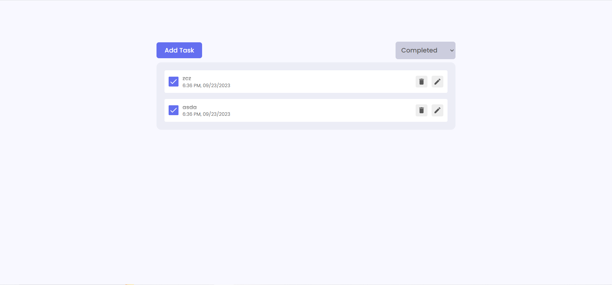

# React Todo App.

A complete todo application with all features.


---

## Project Description

In the project,i have build a simple todo app ,having all the CRUD operations.i have used `React.js` and to manage  states, also i have used  `Redux`. Also wei i have implemented simple animations using `Framer Motion`.

## technology used

- [React](https://reactjs.org/)
- [React Redux](https://redux.js.org/)
- [Framer Motion](https://framer.com/motion/)
- [React icons](https://react-icons.netlify.com/)
- [React Hot Toast](https://react-hot-toast.com/)
- More...

```


